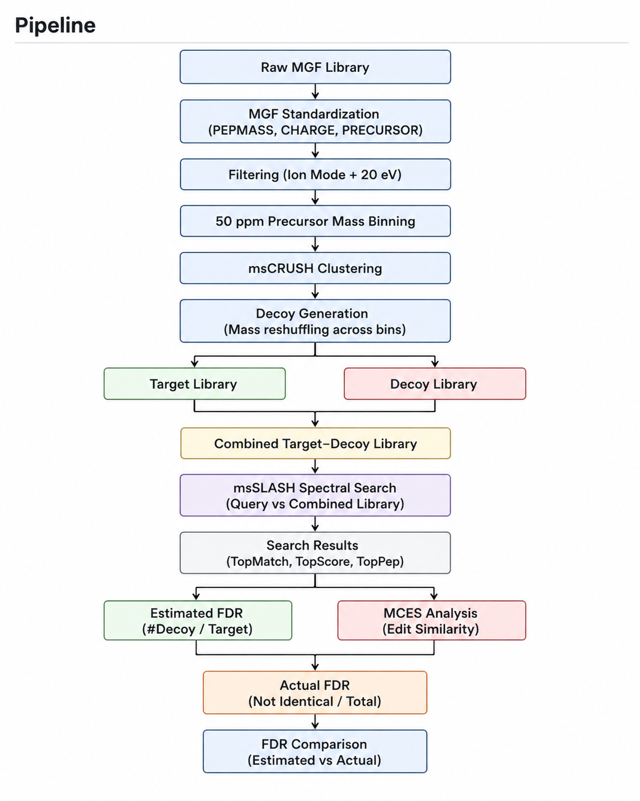

# SPLISUM


**SPLISUM** (Spectral Prediction and Library Searching for Untargeted Metabolomics) is a Python package for metabolite identification using predicted spectral libraries, target–decoy-based false discovery rate (FDR) estimation, structural validation, and cluster-aware analysis.

---

## Installation

```bash
git clone https://github.com/chhavithakur15/SPLISUM.git
cd SPLISUM
pip install -e .
```
---

## Overview

SPLISUM provides an end-to-end workflow: https://github.com/chhavithakur15/SPLISUM.git

- MGF preprocessing and standardization  
- Ion-mode and collision-energy filtering  
- 50 ppm complete-linkage precursor-mass binning  
- msCRUSH-based clustering and library organization  
- Decoy generation via local precursor-mass reshuffling  
- Spectral search using **msSLASH**  
- Estimated FDR calculation (target–decoy)  
- Structural validation using **MCES (edit similarity)**  
- Comparison of estimated vs actual FDR  

---

## Example Usage

A small example dataset is provided in the `examples/` folder to demonstrate how to run SPLISUM on positive and negative ion-mode data.

### Run the positive-mode example

```bash
bash examples/run_example_positive.sh
```

### Run the negative-mode example

```bash
bash examples/run_example_negative.sh
```

### Run the pipeline directly

```bash
python -m splisum.workflow.run_pipeline \
  --input_library examples/data/sample_library_positive.mgf \
  --query_mgf examples/data/sample_query_positive.mgf \
  --target_library_excel examples/data/sample_target_metadata.csv \
  --msslash_path /path/to/msSLASH/bin/bruteforce \
  --mscrush_path /path/to/msCRUSH/bin/mscrush \
  --outdir examples/results
```

### Notes

- The example files are intentionally small and are meant only for testing the workflow.
- Replace `/path/to/msSLASH/bin/bruteforce` and `/path/to/msCRUSH/bin/mscrush` with the actual paths on your system.
- For full experiments, use the complete target library, query spectra, and metadata files.

---

## External Dependencies

SPLISUM requires msSLASH and msCRUSH.

Install them using:

git clone https://github.com/COL-IU/msSLASH.git  
cd msSLASH  
./install.sh  

git clone https://github.com/COL-IU/msCRUSH.git  
cd msCRUSH  
./install.sh  

After installation, provide paths to executables:

--msslash_path /path/to/msSLASH/bin/bruteforce  
--mscrush_path /path/to/msCRUSH/bin/mscrush  

---

## Full Dataset

The full dataset used in this study is publicly available on Zenodo:

👉 https://doi.org/10.5281/zenodo.19810044

### Contents
- Target spectral libraries (positive and negative ion modes, 20 eV)  
- Query spectra (INT dataset)  

### Usage

Download the dataset and place the files in a local directory (e.g., `data/`):

```bash
mkdir data
# move downloaded files here
```

Then run the pipeline as described above using the downloaded files.

---

## Quick Start
Run the full pipeline

    python -m splisum.workflow.run_pipeline \
      --input_library input_library.mgf \
      --query_mgf query.mgf \
      --target_library_excel target_library.xlsx \
      --msslash_path /path/to/bruteforce \
      --mscrush_path /path/to/mscrush \
      --outdir results

---

## Detailed Pipeline

### Step 1: Standardizing MGF Files

Standardizes metadata fields such as `PEPMASS`, `PRECURSOR_MZ`, and `CHARGE`.

Reason: Ensures compatibility with downstream tools like msSLASH.

    python -m splisum.io.mgf \
      --input input_library.mgf \
      --output standardized_library.mgf

---

### Step 2: Filtering by Ion Mode and Collision Energy

Filters spectra to retain only:

- Positive mode: `[M+H]+`  
- Negative mode: `[M-H]-`  
- Collision energy: **20 eV**

Reason: Fragmentation patterns depend on acquisition conditions; mixing them reduces match quality.

    python -m splisum.library.filter \
      --input standardized_library.mgf \
      --output positive_20ev.mgf \
      --mode positive \
      --energy 20

---

### Step 3: 50 ppm Complete-Linkage Binning

Groups spectra into precursor-mass bins using a 50 ppm constraint.

Reason: Prevents loose grouping and preserves realistic mass structure.

    python -m splisum.library.binning \
      --input positive_20ev.mgf \
      --output_folder binned_spectra \
      --ppm 50

---

### Step 4: msCRUSH Clustering

Clusters spectra to generate representative spectra and reduce redundancy.

Reason: Improves library organization and stabilizes downstream decoy generation.

    python -m splisum.clustering.mscrush \
      --mscrush_path /path/to/mscrush \
      --input positive_20ev.mgf \
      --output_prefix clusters/clusters

    python -m splisum.clustering.parse \
      --input clusters \
      --output mscrush_cluster_statistics.xlsx

---

### Step 5: Decoy Generation

Generates decoy spectra by reassigning precursor masses across nearby bins while keeping fragment peaks unchanged.

Reason: Produces realistic incorrect matches required for FDR estimation.

    python -m splisum.decoy.generate \
      --input_folder binned_spectra \
      --output_folder decoy_spectra \
      --seed 42

---

### Step 6: Merge Decoy Library

Combines all decoy spectra into a single file.

    python -m splisum.library.combine \
      merge-folder \
      --input_folder decoy_spectra \
      --output decoy_library.mgf

---

### Step 7: Build Combined Target–Decoy Library

Combines the target spectra and generated decoy spectra into a single searchable library.

Reason: SPLISUM performs msSLASH search on a unified library containing both target and decoy entries.

    python -m splisum.library.combine \
      merge-files \
      --inputs positive_20ev.mgf decoy_library.mgf \
      --output combined_target_decoy_library.mgf

---

### Step 8: Spectral Search (msSLASH)

Searches query spectra against the combined target–decoy library.

Reason: The decoy spectra are already merged into the target library before search.  
The `-d` argument uses a dummy MGF file internally because msSLASH requires it.

    python -m splisum.search.msslash \
      --msslash_path /path/to/bruteforce \
      --library combined_target_decoy_library.mgf \
      --query query.mgf \
      --output msslash_output.txt

---

### Step 9: Estimated FDR

Estimated FDR is computed as:

    Estimated FDR = (# Decoy Hits) / (# Target Hits)

Reason: Provides a fast statistical estimate of false positives.

    python -m splisum.fdr.estimated \
      --input msslash_output.txt \
      --output estimated_fdr.xlsx

---

### Step 10: Prepare Input for Actual FDR

Maps query and target compounds and computes edit similarity (MCES).

Reason: Enables structure-based validation of matches.

    python -m splisum.fdr.prepare_actual_fdr_input \
      --msslash_txt msslash_output.txt \
      --target_mgf positive_20ev.mgf \
      --query_mgf query.mgf \
      --target_library_excel target_library.xlsx \
      --output actual_fdr_input.xlsx

---

### Step 11: Actual FDR Calculation

Classifies matches into:

- Exact Match  
- Stereoisomer  
- Highly Similar (≥ 0.9)  
- Not Identical (< 0.9)

Actual FDR is computed as:

    Actual FDR = Not Identical / Total

Reason: Measures true correctness using structural similarity.

    python -m splisum.fdr.actual_fdr \
      --input actual_fdr_input.xlsx \
      --output actual_fdr.xlsx

---

### Step 12: Compare Estimated vs Actual FDR

Generates comparison table and visualization.

Reason: Highlights the gap between statistical and structural validation.

    python -m splisum.postprocess.compare_fdr \
      --estimated estimated_fdr.xlsx \
      --actual actual_fdr.xlsx \
      --output_table fdr_comparison.xlsx \
      --output_plot fdr_comparison.png

---

## Important Note 

Estimated FDR < Actual FDR

Estimated FDR is based on decoy matches, whereas actual FDR reflects structural correctness.

---


